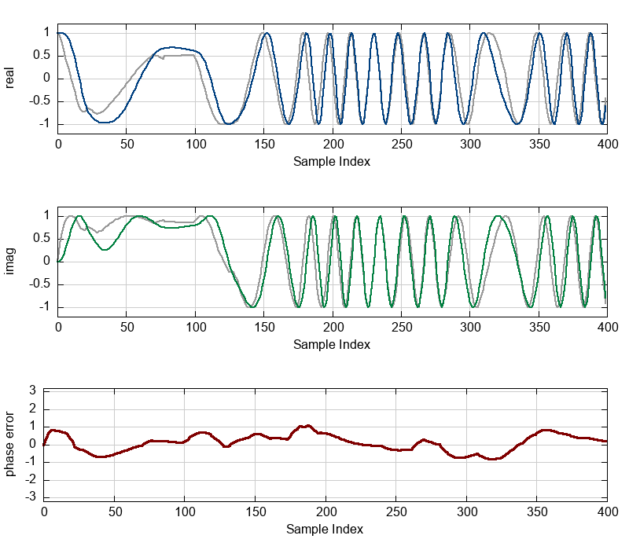

## Notes
Based on https://en.wikipedia.org/wiki/Phase-locked_loop and ported directly from the C code as per https://liquidsdr.org/blog/pll-howto/

Can lock onto reference signal even when frequency is allowed to vary randomly (noisy), e.g.:

`cargo run -- --ref.varyRandomChance=0.9 --ref.varyRandomMax=0.1 --ref.frequency 0.2 --samples 400 --pll.bandwidth 0.02 > pll_example.dat && gnuplot -e 'set terminal png size 800,700' pll_example.gnuplot > pll_example.png`

...produces output like:



## What I've learned
When the input/reference frequency (`--ref.frequency`) is increased, it helps to increase the bandwidth (`--pll.bandwidth`) of the output/signal accordingly, or it will take very long to achieve lock (if at all!). 

A similar effect can be achieved by increasing the damping factor (`--ref.damping`) - possibly because this allows the output oscillator to change frequency more quickly, at the risk of introducing more noise.


## Installation and running

If needed, install gnuplot first, e.g. 
```
brew install gnuplot
```

Run the demo and output to dat file:
```
cargo run > pll_example.dat  
```

Output the plot using gnuplot:
```
gnuplot -e 'set terminal png size 800,700' pll_example.gnuplot > pll_example.png
```

## TODO
- [x] Simulate varying frequency
- [ ] Automatic peak detection from noisy ref?